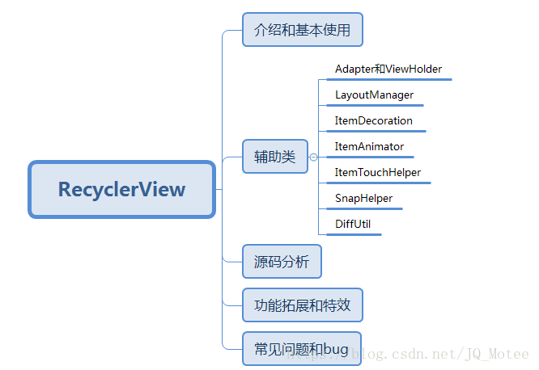

# RecyclerVew介绍
### 一、目录


### 二、介绍和基本使用
RecyclerView是Android 5.0提出的新UI控件，位于support-v7包中，向下兼容到android 3.0版本，在很多列表场景中能替代ListView和GridView。
基本使用分三步：

```
//第一步
RecyclerView recyclerView = (RecyclerView) findViewById(R.id.recyclerView);

ArrayList<Post> data = new ArrayList<>();
data.add(new Post("Marshmallow", "http://i.imgur.com/mVpDmzc.jpg", "Android 66666666666666"));
data.add(new Post("Lollipop", "http://i.imgur.com/kyVfpYh.png", "Android 55555555555555"));

MyAdapter adapter = new MyAdapter(this, data);
//第二步
recyclerView.setLayoutManager(new LinearLayoutManager(this));
//第三步
recyclerView.setAdapter(adapter);
```

详情参见：[介绍和基本使用](https://mp.weixin.qq.com/s/CzrKotyupXbYY6EY2HP_dA)
### 三、辅助类
RecyclerView的强大和可扩展性离不开其众多辅助类。其中`Adapter和ViewHolder`以及`LayoutManager`是展示列表所必须的，其他辅助类配合能完成更多复杂炫酷的需求。

|辅助类 | 简介 | 详细介绍 | 优秀开源库链接 |
| :-: | :-: | :-: | :-: |
| Adapter和ViewHolder | RecyclerView本身不创建视图，视图的创建和显示由ViewHolder负责。ViewHolder的创建和数据绑定由Adapter负责 | [Adapter和ViewHolder简介](https://blog.csdn.net/yjfhacker/article/details/52412394) <br/> <br/>    [RecyclerView的ViewHolder和Adapter的封装](http://blog.devwiki.net/index.php/2016/07/17/Recycler-View-Adapter-ViewHolder-optimized.html) | [BaseRecyclerViewAdapterHelper](https://github.com/CymChad/BaseRecyclerViewAdapterHelper) |
|   LayoutManager    | LayoutManager负责RecyclerView的布局，其中包含了Item View的获取与回收 | [LayoutManager的基本使用](https://juejin.im/entry/59c45d625188254f58412a97)        <br/> <br/> [自定义LayoutManager](https://blog.csdn.net/qibin0506/article/details/52676670) | [LayoutManager开源库合集](https://mp.weixin.qq.com/s/59YLxK8C5IGwwpZ9P8NjZw)   <br/>  <br/>[LayoutManagerGroup](https://github.com/DingMouRen/LayoutManagerGroup) |
|   ItemDecoration   |               ItemView的装饰器               |  [深入解析 RecyclerView.ItemDecoration类（含实例讲解）](https://www.jianshu.com/p/9a796bb23a47)  | [RecyclerView-FlexibleDivider](https://github.com/yqritc/RecyclerView-FlexibleDivider) <br/>  <br/> [TimeLine](https://github.com/vivian8725118/TimeLine) |
|    ItemAnimator    |          ItemView添加、移除、更新的动画效果           |  [RecyclerView的item动画效果](https://www.jianshu.com/p/b375d552db63)  | [recyclerview-animators](https://github.com/wasabeef/recyclerview-animators) |
|  ItemTouchHelper   |                ItemView拖拽                | [RecyclerView实现条目Item拖拽排序与滑动删除](https://blog.csdn.net/yanzhenjie1003/article/details/51935982) | [Android-ItemTouchHelper-Demo](https://github.com/iPaulPro/Android-ItemTouchHelper-Demo) |
|     SnapHelper     |              ItemView的对齐规则               | [SnapHelper详解](https://www.jianshu.com/p/e54db232df62) <br/>  <br/>[SnapHelper介绍](https://juejin.im/post/58dd3d53da2f60005fbb0a6c) | [RecyclerViewSnap](https://github.com/rubensousa/RecyclerViewSnap) |
|      DiffUtil      | 配合RecyclerView 使用，通过比对新、旧两个数据集的差异，生成旧数据到新数据的最小变动，然后对有变动的数据项，进行局部刷新 | [详解DiffUtil](https://blog.csdn.net/zxt0601/article/details/52562770)<br/>  <br/> [DiffUtil介绍](https://juejin.im/post/5995ba616fb9a024747ed8e8) |                                     |
### 四、源码分析
[RecyclerView 源码解析](https://juejin.im/entry/586a12c5128fe10057037fba)
[RecyclerView 整体设计](https://www.jianshu.com/p/9ddfdffee5d3)
[RecyclerView剖析](https://blog.csdn.net/qq_23012315/article/details/50807224)
### 五、功能拓展和特效

 1. [RecyclerView嵌套实现多级目录](https://blog.csdn.net/xiaozhoubaiyong/article/details/70157150)
 2. [RecyclerView添加Header和Footer](https://blog.csdn.net/lmj623565791/article/details/51854533)
 3. [Item侧滑删除](https://github.com/daimajia/AndroidSwipeLayout)
 4. 下拉刷新、上拉加载的优秀开源库[XRecyclerView](https://github.com/XRecyclerView/XRecyclerView)、[SmartRefreshLayout](https://github.com/scwang90/SmartRefreshLayout)、官方的`SwipeRefreshLayout`
 
### 六、常见问题和bug
 5.  [Android 6.0 解决recyclerview 在 scrollview 中不能全部显示](https://www.jianshu.com/p/3815d36fd371?nomobile=yes)
 6. [RecyclerView滑动到指定位置](https://blog.csdn.net/shanshan_1117/article/details/78780137)


